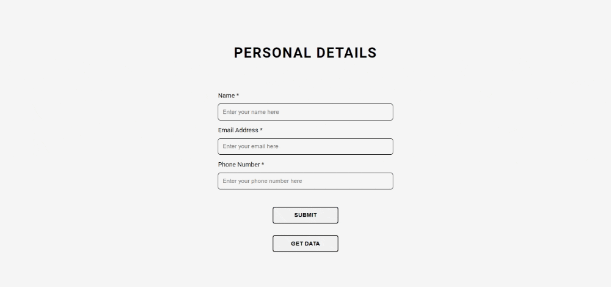
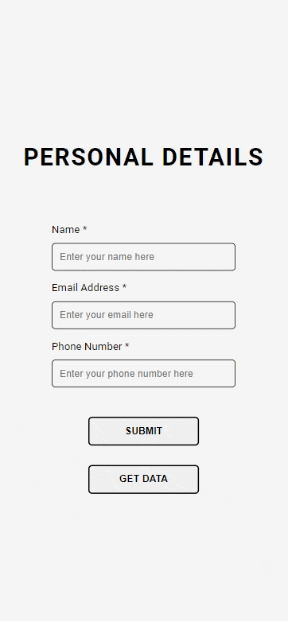
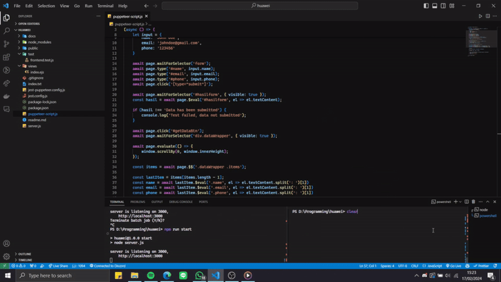
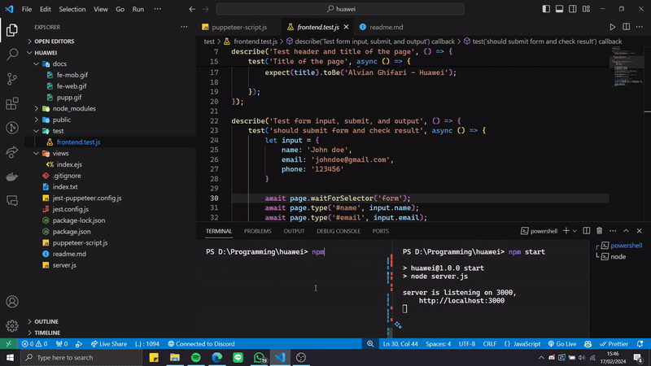

# Huawei Technical Test - Alvian Ghifari Backend


## Table of Contents

- [Prerequisite](#prerequisite)
- [Installation](#installation)
- [Number 1](#number-1)
- [Number 2](#number-2)
- [Number 3](#number-3)

## Prerequisite

Make sure you have the following prerequisites installed on your system:

* Node.js 
* Node Package Manager (NPM)

## Installation
Below are the steps to run the frontend and backend:
1. **Clone the Repository**
   ```sh
    git clone https://github.com/alvingxv/huawei-alvian-backend.git
    cd huawei-alvian-backend
   ```

2. **Install the Dependencies**
    
    Install the dependencies for the frontend and backend

   ```sh
   npm install
   ```

3. **Start the Application**

    Run the frontend and backend
   ```sh
    npm start
    ```

4. **Open your Browser**

    The frontend and backend should be running at [localhost:3000](http://localhost:3000/)

## Number 1
Soal: Buatlah halaman web sederhana menggunakan HTML, CSS, dan JavaScript. Halaman tersebut harus memiliki form pendaftaran dengan beberapa field, seperti nama, email, dan nomor telepon Tambahkan validasi sederhana menggunakan JavaScript untuk memastikan bahwa semua field telah diisi sebelum data dikirimkan.

### Result
#### Website Screen Size

#### Mobile Screen Size



## Number 2

Soal: Bangun sebuah server sederhana menggunakan Node.js atau framework Express.Buatlah endpoint API yang dapat menerima data formulir dari frontend pada Hari 1 dan menyimpannya ke dalam sebuah penyimpanan data sederhana, misalnya dalam bentuk array di dalam server. Pastikan bahwa server dapat mengembalikan data yang telah disimpan ketika diminta oleh frontend.

### Result

#### **Endpoint Render HTML**
To render the HTML file, EJS is used as the template engine. The HTML file is located in the **views folder**. The **public folder** is used to store static files such as CSS.
```javascript
app.set('views', path.join(__dirname, './views/'))
app.set('view engine', 'ejs')
app.use("/public", express.static('public'))

app.get('/', (req, res) => {
    res.render('index')
})
```
#### **Endpoint Submit**
To save the data, array is used as the storage in the server memory.
```javascript
let memory_storage = []

details.post('/', (req, res) => {
    let { name, email, phone } = req.body

    memory_storage.push({ name, email, phone })

    res.json({
        message: "Data has been saved",
        status: 200
    })
})
```
Example of response from the `localhost:3000/details` **POST** endpoint
```json
{
    "message": "Data has been saved",
    "status": 200
}
```

#### **Endpoint Get Data**
```javascript
details.get('/', (req, res) => {
    res.json({
        message: "Data has been fetched",
        status: 200,
        data: memory_storage
    })
})
```
Example of response from the `localhost:3000/details` **GET** endpoint
```json
{
    "message": "Data has been fetched",
    "status": 200,
    "data": [
        {
            "name": "Alvian Ghifari Ghifari",
            "email": "alvian2002286@gmail.com",
            "phone": "6285648175777"
        },
        {
            "name": "name",
            "email": "name@email.com",
            "phone": "123456"
        }
    ]
}
```


## Number 3
Soal: Buatlah skrip otomatis menggunakan Selenium atau Puppeteer untuk mengotomatisasi pengujian frontend yang telah Anda bangun pada Hari 1. Skrip harus dapat memasukkan data ke dalam formulir, mengirim formulir, dan memverifikasi bahwa data telah disimpan dengan benar pada server backend yang telah Anda bangun pada Hari 2.

### Hasil
On this question, I made two testing versions. First using puppeteer only, and second using puppeteer with jest.

#### 1. Puppeteer Only
To run the testing using Puppeteer, I created a file [`puppeteer-script.js`](puppeteer-script.js).

On this file, I made a script to fill the form, submit the form, and verify the data that has been saved on the backend server. To run this script, run:
```bash
 node puppeteer-script.js
```



#### 2. Puppeteer with Jest
To run the testing using Puppeteer with Jest, I created a file [`test\frontend.test.js`](https://github.com/alvingxv/huawei-alvian-backend/blob/main/test/frontend.test.js)

To run this script, run:
```bash
 npm test
```
